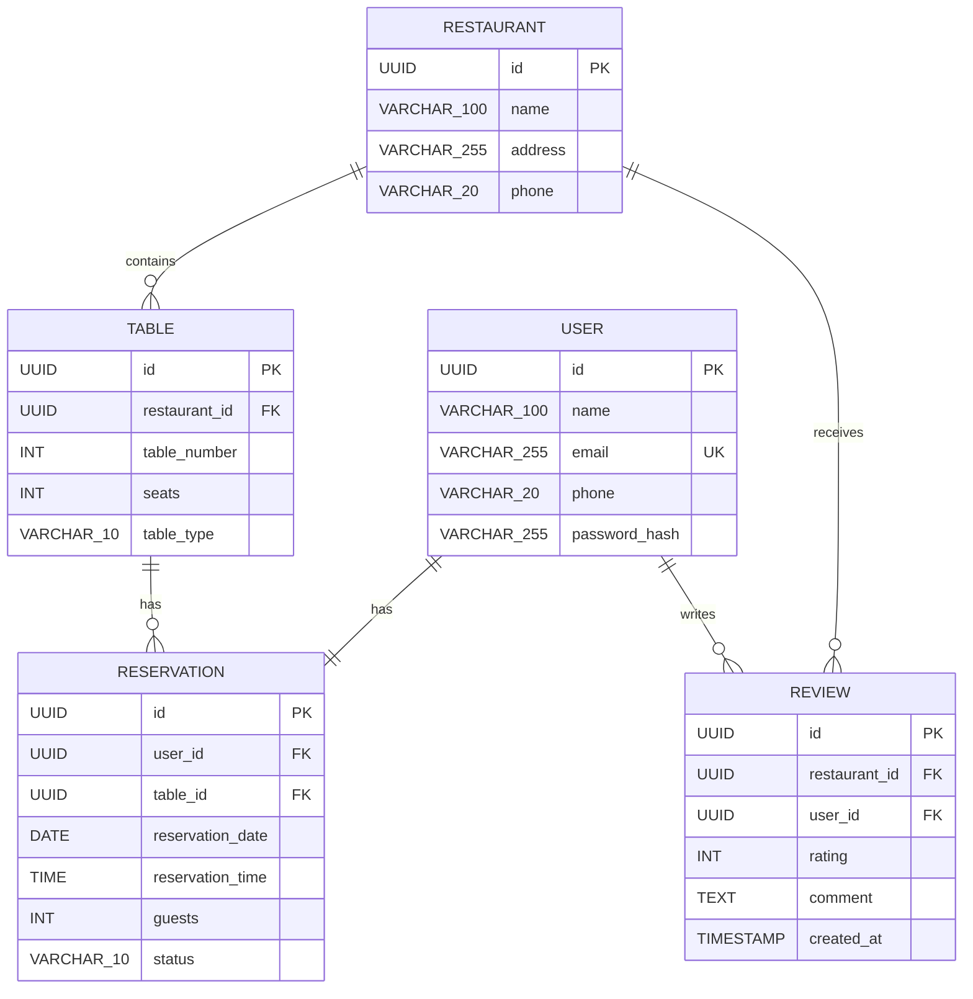

```mermaid
erDiagram

    USER ||--|| RESERVATION : "has"
    RESTAURANT ||--o{ TABLE : "contains"
    TABLE ||--o{ RESERVATION : "has"
    RESTAURANT ||--o{ REVIEW : "receives"
    USER ||--o{ REVIEW : "writes"

    USER {
        UUID id PK
        VARCHAR_100 name
        VARCHAR_255 email UK
        VARCHAR_20 phone
        VARCHAR_255 password_hash
    }

    RESTAURANT {
        UUID id PK
        VARCHAR_100 name
        VARCHAR_255 address
        VARCHAR_20 phone
    }

    TABLE {
        UUID id PK
        UUID restaurant_id FK
        INT table_number
        INT seats
        VARCHAR_10 table_type
    }

    RESERVATION {
        UUID id PK
        UUID user_id FK
        UUID table_id FK
        DATE reservation_date
        TIME reservation_time
        INT guests
        VARCHAR_10 status
    }

    REVIEW {
        UUID id PK
        UUID restaurant_id FK
        UUID user_id FK
        INT rating
        TEXT comment
        TIMESTAMP created_at
    }
```
