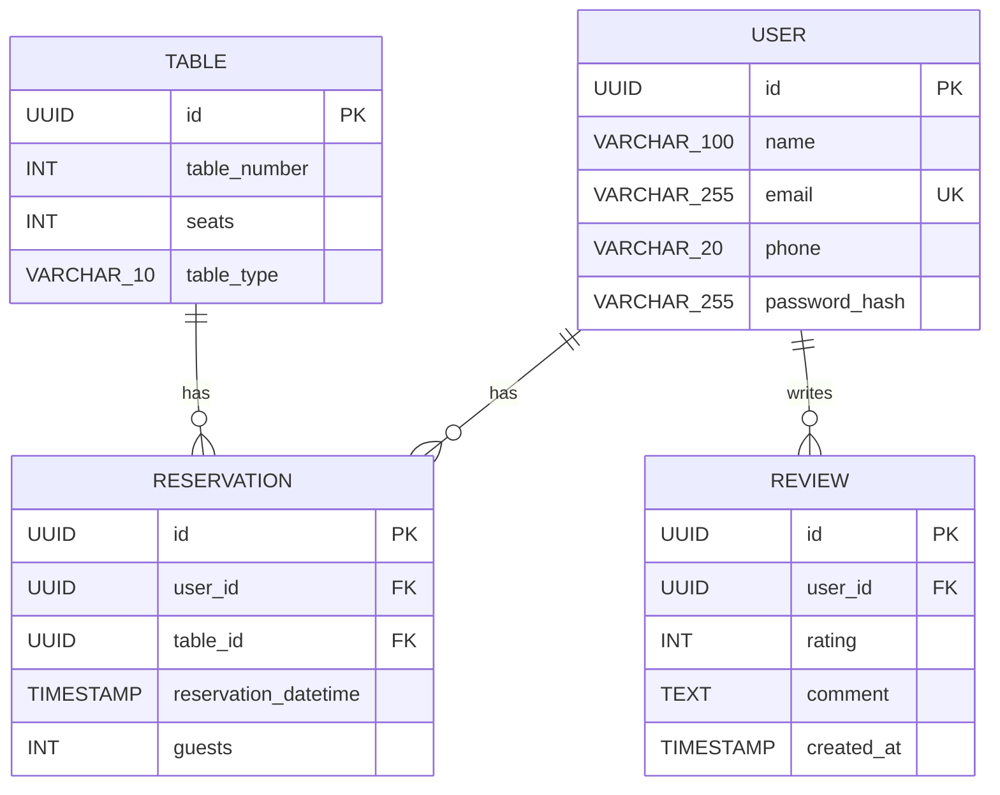

```mermaid
erDiagram

    USER ||--o{ RESERVATION : "has"
    TABLE ||--o{ RESERVATION : "has"
    USER ||--o{ REVIEW : "writes"

    USER {
        UUID id PK
        VARCHAR_100 name
        VARCHAR_255 email UK
        VARCHAR_20 phone
        VARCHAR_255 password_hash
    }

    TABLE {
        UUID id PK
        INT table_number
        INT seats
        VARCHAR_10 table_type
    }

    RESERVATION {
        UUID id PK
        UUID user_id FK
        UUID table_id FK
        TIMESTAMP reservation_datetime
        INT guests
    }

    REVIEW {
        UUID id PK
        UUID user_id FK
        INT rating
        TEXT comment
        TIMESTAMP created_at
    }
```
