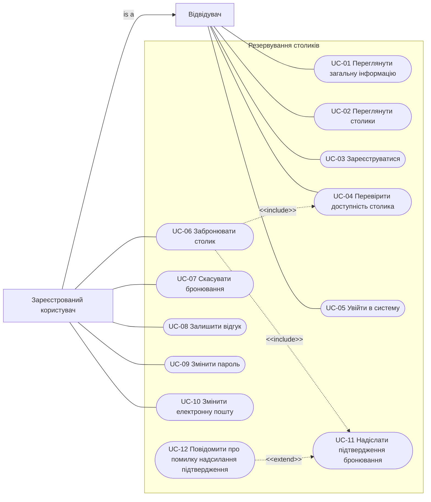

```mermaid
flowchart LR
    Visitor["Відвідувач"]
    Registered["Зареєстрований користувач"]

    Registered -->|is a| Visitor

    subgraph System["Резервування столиків"]
        UC01(["UC-01 Переглянути загальну інформацію"])
        UC02(["UC-02 Переглянути столики"])
        UC03(["UC-03 Зареєструватися"])
        UC04(["UC-04 Перевірити доступність столика"])
        UC05(["UC-05 Увійти в систему"])
        UC06(["UC-06 Забронювати столик"])
        UC07(["UC-07 Скасувати бронювання"])
        UC08(["UC-08 Залишити відгук"])
        UC09(["UC-09 Змінити пароль"])
        UC10(["UC-10 Змінити електронну пошту"])
        UC11(["UC-11 Надіслати підтвердження бронювання"])
        UC12(["UC-12 Повідомити про помилку надсилання підтвердження"])
    end

    Visitor --- UC01
    Visitor --- UC02
    Visitor --- UC03
    Visitor --- UC04
    Visitor --- UC05

    Registered --- UC06
    Registered --- UC07
    Registered --- UC08
    Registered --- UC09
    Registered --- UC10

    UC06 -. "&lt;&lt;include&gt;&gt;" .-> UC04
    UC06 -. "&lt;&lt;include&gt;&gt;" .-> UC11
    UC12 -. "&lt;&lt;extend&gt;&gt;" .-> UC11
```
