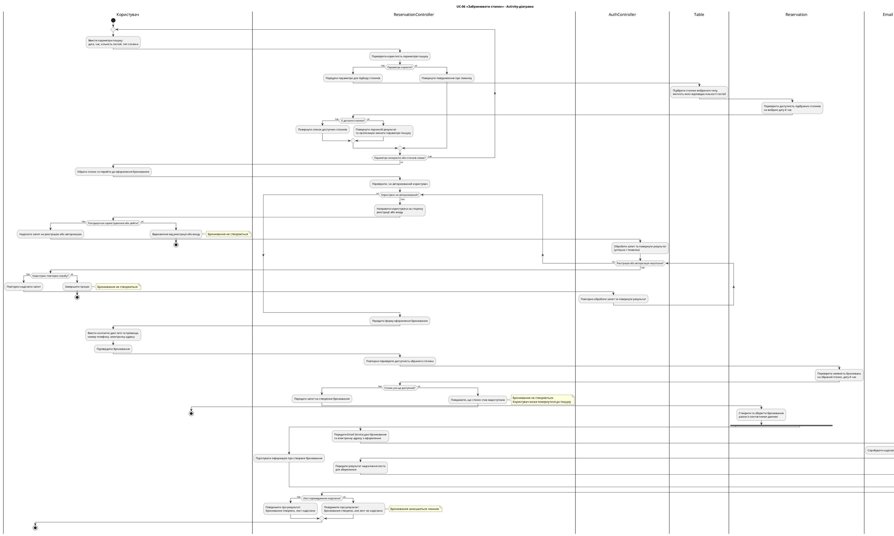

```plantuml
@startuml
title UC-06 «Забронювати столик» - Activity-діаграма

|Користувач|
|ReservationController|
|AuthController|
|Table|
|Reservation|
|Email Service|
|EmailConfirmation|

|Користувач|
start

repeat
|Користувач|
:Ввести параметри пошуку:
дата, час, кількість гостей, тип столика;

    |ReservationController|
    :Перевірити коректність параметрів пошуку;

    if (Параметри коректні?) then (так)
        :Передати параметри для підбору столиків;

        |Table|
        :Підібрати столики вибраного типу,
        місткість яких відповідає кількості гостей;

        |Reservation|
        :Перевірити доступність підібраних столиків
        на вибрані дату й час;

        |ReservationController|
        if (Є доступні столики?) then (так)
            :Повернути список доступних столиків;
        else (ні)
            |ReservationController|
            :Повернути порожній результат
            та пропозицію змінити параметри пошуку;
        endif

    else (ні)
        |ReservationController|
        :Повернути повідомлення про помилку;
    endif

repeat while (Параметри некоректні або столиків немає?) is (так) not (ні)

|Користувач|
:Обрати столик та перейти до оформлення бронювання;

|ReservationController|
:Перевірити, чи авторизований користувач;

while (Користувач не авторизований?) is (так)
:Направити користувача на сторінку
реєстрації або входу;

    |Користувач|
    if (Погоджується зареєструватися або увійти?) then (так)
        :Надіслати запит на реєстрацію або авторизацію;

        |AuthController|
        :Обробити запит та повернути результат
        (успішно / помилка);

        while (Реєстрація або авторизація неуспішна?) is (так)
            |Користувач|
            if (Користувач повторює спробу?) then (так)
                :Повторно надіслати запит;

                |AuthController|
                :Повторно обробити запит та повернути результат;
            else (ні)
                |Користувач|
                :Завершити процес;
                note right: Бронювання не створюється
                stop
            endif
        endwhile (ні)

    else (ні)
        |Користувач|
        :Відмовитися від реєстрації або входу;
        note right: Бронювання не створюється
        stop
    endif

endwhile (ні)

|ReservationController|
:Передати форму оформлення бронювання;

|Користувач|
:Ввести контактні дані: ім'я та прізвище,
номер телефону, електронну адресу;
:Підтвердити бронювання;

|ReservationController|
:Повторно перевірити доступність обраного столика;

|Reservation|
:Перевірити наявність бронювань
на обраний столик, дату й час;

|ReservationController|
if (Столик усе ще доступний?) then (так)
:Передати запит на створення бронювання;

    |Reservation|
    :Створити та зберегти бронювання
    разом із контактними даними;

    fork
        |ReservationController|
        :Підготувати інформацію про створене бронювання;

    fork again
        |ReservationController|
        :Передати Email Service дані бронювання
        та електронну адресу з оформлення;

        |Email Service|
        :Спробувати надіслати лист-підтвердження;

        |ReservationController|
        :Передати результат надсилання листа
        для збереження;

        |EmailConfirmation|
        :Зберегти результат надсилання листа;
    end fork

    |ReservationController|
    if (Лист-підтвердження надіслано?) then (так)
        :Повідомити про результат:
        бронювання створено, лист надіслано;
    else (ні)
        :Повідомити про результат:
        бронювання створено, але лист не надіслано;
        note right: Бронювання залишається чинним
    endif

    |Користувач|
    stop

else (ні)
|ReservationController|
:Повідомити, що столик став недоступним;
note right: Бронювання не створюється.\nКористувач може повернутися до пошуку

    |Користувач|
    stop

endif
@enduml
```
