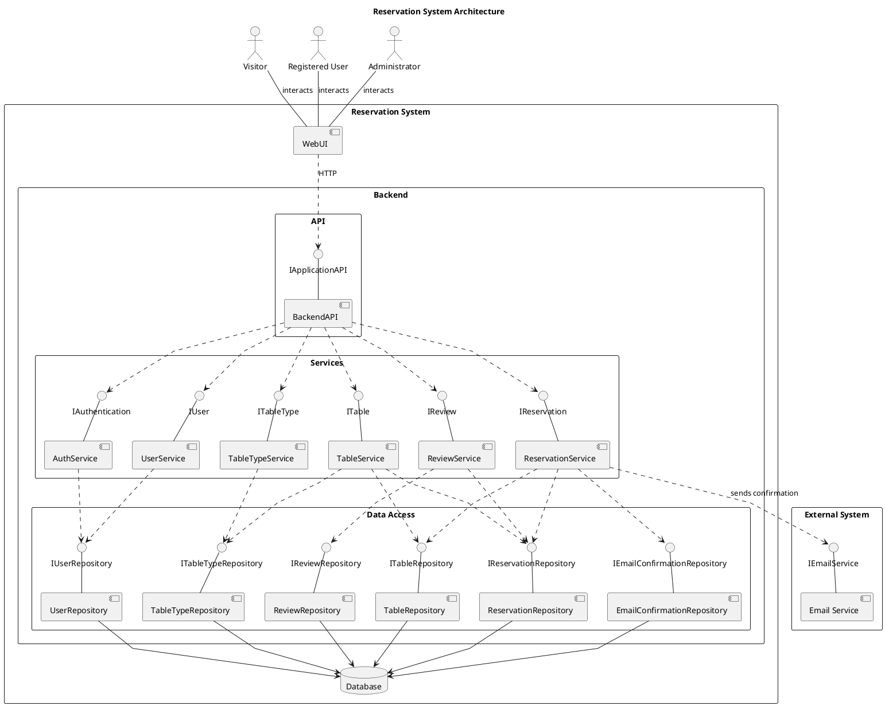

```plantuml
@startuml
top to bottom direction

skinparam linetype polyline
skinparam componentStyle uml2
skinparam packageStyle rectangle
skinparam shadowing false
skinparam nodesep 35
skinparam ranksep 45

title Reservation System Architecture

actor "Visitor" as Visitor
actor "Registered User" as User
actor "Administrator" as Admin

rectangle "Reservation System" {

    component "WebUI" as UI

    package "Backend" {

        package "API" as ApiLayer {
            interface "IApplicationAPI" as IAPI
            component "BackendAPI" as API
        }

        package "Services" {
            interface "IAuthentication" as IAuth
            interface "IUser" as IUser
            interface "ITable" as ITable
            interface "ITableType" as ITableType
            interface "IReservation" as IReservation
            interface "IReview" as IReview

            component "AuthService" as Auth
            component "UserService" as UserSvc
            component "TableService" as TableSvc
            component "TableTypeService" as TypeSvc
            component "ReservationService" as ReservationSvc
            component "ReviewService" as ReviewSvc
        }

        package "Data Access" {
            interface "IUserRepository" as IUserRepo
            interface "ITableRepository" as ITableRepo
            interface "ITableTypeRepository" as ITypeRepo
            interface "IReservationRepository" as IReservationRepo
            interface "IReviewRepository" as IReviewRepo
            interface "IEmailConfirmationRepository" as IEmailRepo

            component "UserRepository" as UserRepository
            component "TableRepository" as TableRepository
            component "TableTypeRepository" as TypeRepository
            component "ReservationRepository" as ReservationRepository
            component "ReviewRepository" as ReviewRepository
            component "EmailConfirmationRepository" as EmailRepository
        }
    }

    database "Database" as DB
}

package "External System" {
    interface "IEmailService" as IEmailService
    component "Email Service" as EmailService
}

' Actors
Visitor -- UI : interacts
User -- UI : interacts
Admin -- UI : interacts

' WebUI -> API
UI ..> IAPI : HTTP
IAPI -- API

' API -> Services
API ..> IAuth
API ..> IUser
API ..> ITable
API ..> ITableType
API ..> IReservation
API ..> IReview

IAuth -- Auth
IUser -- UserSvc
ITable -- TableSvc
ITableType -- TypeSvc
IReservation -- ReservationSvc
IReview -- ReviewSvc

' Services -> Repositories
Auth ..> IUserRepo
UserSvc ..> IUserRepo

TableSvc ..> ITableRepo
TableSvc ..> ITypeRepo
TableSvc ..> IReservationRepo

TypeSvc ..> ITypeRepo

ReservationSvc ..> ITableRepo
ReservationSvc ..> IReservationRepo
ReservationSvc ..> IEmailRepo

ReviewSvc ..> IReservationRepo
ReviewSvc ..> IReviewRepo

' Repositories
IUserRepo -- UserRepository
ITableRepo -- TableRepository
ITypeRepo -- TypeRepository
IReservationRepo -- ReservationRepository
IReviewRepo -- ReviewRepository
IEmailRepo -- EmailRepository

' Repositories -> Database
UserRepository --> DB
TableRepository --> DB
TypeRepository --> DB
ReservationRepository --> DB
ReviewRepository --> DB
EmailRepository --> DB

' External Integration
ReservationSvc ..> IEmailService : sends confirmation
IEmailService -- EmailService
@enduml
```
